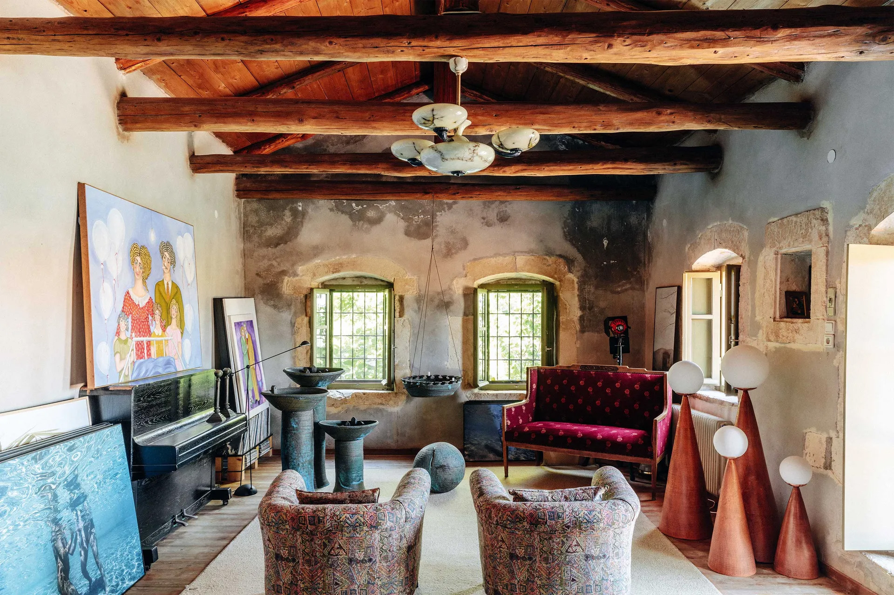
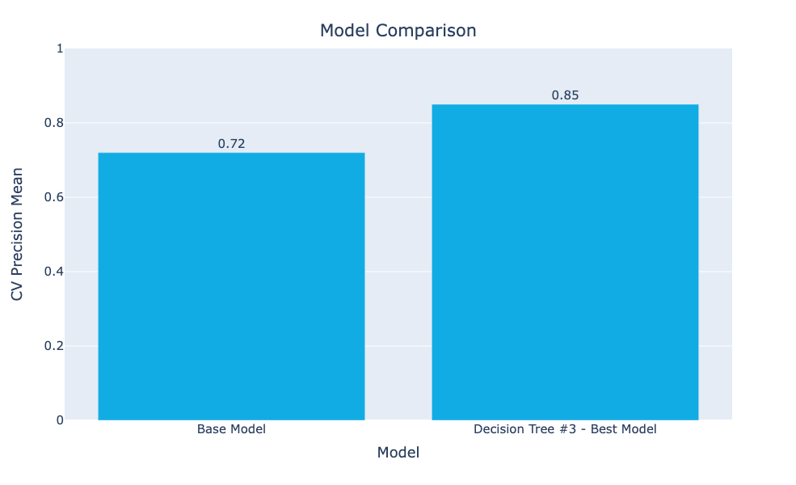
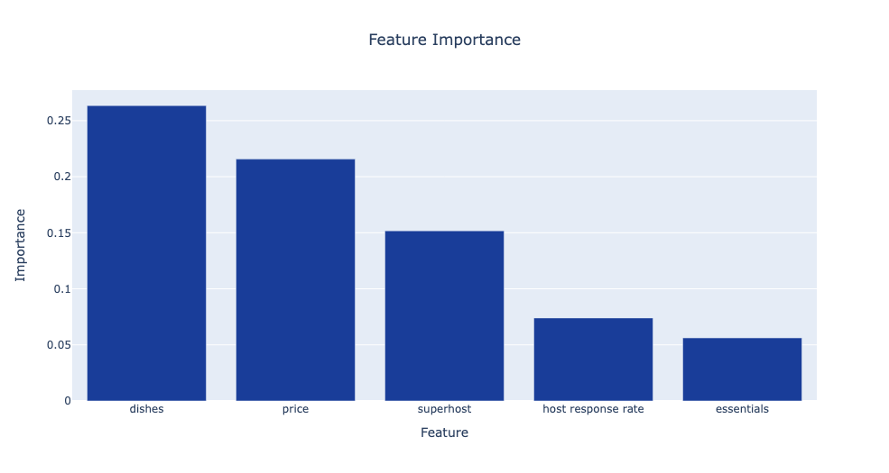
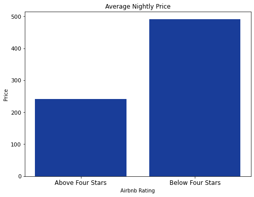
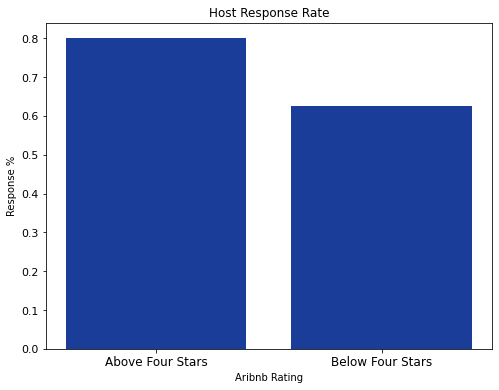

# Optimizing Airbnb Listings in Crete: A Classification Model for 4-Star Ratings



**Author**:

Stephanie Ciaccia

## Overview

Crete, the largest island in Greece, is a popular tourist destination known for its beautiful beaches, rich history, and culinary delights. The tourism industry is a significant contributor to the island's economy, generating a considerable portion of its GDP and providing employment opportunities to many local residents. In recent months, there has been a notable increase in traffic numbers from non-European airports between January and March 2023, indicating a strong recovery in the tourism industry.

## Business Problem

The Greek National Tourism Organisation aims to present their predictive analysis of Airbnb listings to the local housing committee. The objective of the presentation is to identify the essential features associated with high ratings (4 stars and above) on Airbnb listings, assisting new entrants to the Airbnb market by offering insights and recommendations to hosts on how to enhance their listings and ultimately improve guest satisfaction.

## Data

- **Insider airbnb** - For this analysis, the Crete Detailed Listings data for March 2023 was obtained from [Insider airbnb]([http://insideairbnb.com/), a mission-driven project that provides data and advocacy regarding Airbnb's impact on residential communities. The dataset comprises over 30,000 entries and 74 rows of features related to the physical Airbnb properties, host characteristics, and reviews. The information is scraped from the website.

## Methods

To identify the best classification model for predicting Airbnb ratings, an iterative approach was used. The final model selected was a **decision tree** with a precision score of 0.85 that includes both numerical and categorical variables such as: 

- home essentials (dishes and kitchen supplies)
- superhost
- host response rate
- price
- listing type
- bedrooms

The precision score was used as the main metric to determine the model's performance. Precision helps reduce false positives while predicting ratings, which is essential to prevent misclassification of low-rated properties as having high ratings, giving Airbnb hosts false expectations of an increase in bookings and reviews.



## Results

The analysis of the predictive model identified four key features with the highest performance:

- home essentials
- price
- host response rate
- superhost*

* Although superhost is among the top features, since the objective is to assist new Airbnb hosts in optimizing their listings and properties, this metric is not actionable and was not included in the final recommendations.



### Home Essentials
Home essentials and dishes (kitchen supplies) are the most important features in predicting airbnb ratings. Essential amenities are the basic items that a guest expects in order to have a comfortable stay. These include:

- Dishes
- Toilet paper
- Soap (for hands and body)
- One towel per guest
- One pillow per guest
- Linens for each guest bed

### Price
- Price is positively negatively correlated with 4 star ratings. The average nightly price for 4 star listings is **$241** compared to **$490** for homes with less than 4 star ratings.



### Host Response Rate
- The average host response rate for listings with 4 star ratings is about **20%** higher than the host response rate for listings with ratings below 4 stars.




## Conclusions

Based on the analysis, three features with the highest feature importance were identified as the most critical in classifying Airbnb ratings in Crete. Hosts should consider the following recommendations to improve their listings and guest satisfaction:

- **Price**: Hosts should price their listings competitively and reconsider nightly rates that are too high
    
- **Home Essentials**: Hosts should ensure that their listings are stocked with home essentials for their guests' stay

- **Host Response Rate**: Hosts should respond promptly to all messages to improve their ratings.

## Next Steps

To gain a more comprehensive understanding of the factors that influence Airbnb ratings, additional research is required, such as examining more Airbnb data. Furthermore, it would be beneficial to improve the class imbalance present in the dataset by adjusting the weight of the target variables.

## For More Information

See the full analysis in the [Jupyter Notebook](https://github.com/stephcia/crete-airbnb-classification-model/blob/main/crete_airbnb_ratings.ipynb)

## Repository Structure

```
├── data
    ├──archive
├── images
├── .gitignore
├── crete_airbnb_ratings.ipynb
├── crete_airbnb_ratings_presentation.pdf
├── LICENSE
└── README.md
